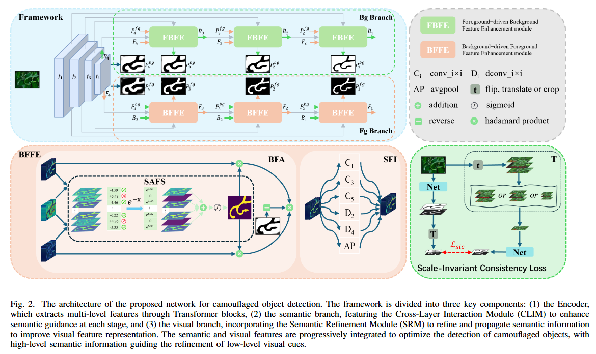
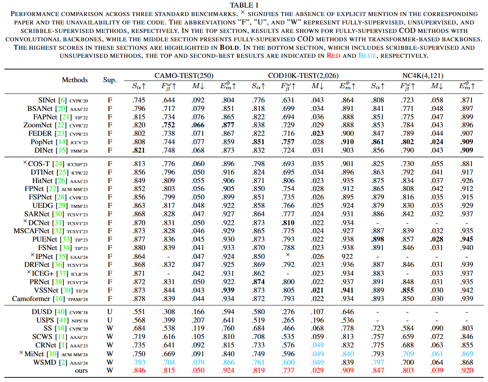

# Mutual Iterative Refinement Network for Scribble-Supervised Camouflaged Object Detection
> Authors: Chao Yin, Kequan Yang, Jide Li, Xiaoqiang Li



## Dataset
- S-COD dataset [(Download)](https://drive.google.com/file/d/1u7PRtZDu2vXCRe0o2SplVYa7ESoZQFR-/view?usp=sharing) for training (4,040 images (3,040 from COD10K, 1,000 from CAMO) with scribbles). In our annotations, "1" stands for foregrounds, "2" for backgrounds, and "0" for unlabeled regions. (The image is viewed as black because its range is 0-255)
- Download the training dataset (COD10K-train) at [here](https://drive.google.com/file/d/1D9bf1KeeCJsxxri6d2qAC7z6O1X_fxpt/view?usp=sharing).
- Download the testing dataset (COD10K-test + CAMO-test + CHAMELEON) at [here](https://drive.google.com/file/d/1QEGnP9O7HbN_2tH999O3HRIsErIVYalx/view?usp=sharing).


## Experimental Results
- We provide MIR-Net [testing maps](https://drive.google.com/file/d/1KgTpMmiBl8_J7YJK3eu3SMhlPP2z5JX-/view?usp=sharing) and [training weights](https://drive.google.com/file/d/1aVsv61VE9t687mCcz_8oUFy8Qj6OhVOz/view?usp=sharing) presented in the papers.




## Code
### Requirements
```shell
git clone --recurse-submodules https://github.com/ycyinchao/MIR-Net.git
pip install -r requirements.txt
```

### Pretrained weights
The pretrained weight can be found here:
[pvtv2](https://drive.google.com/file/d/1rKmp0Zu1ZL6Z9VsYfYAKRkG271AvZB6G/view?usp=sharing).

### Train
- Modify the path in `train.py`.
- Run `python train.py`.

### Test and Evaluate
- Modify the path in `test.py`
- Run `python test.py`.

### Evaluate
- modify the path in `eval/test_metrics.py`
- Run `python eval/test_metrics.py`

### Credit
The code is partly based on [CRNet](https://github.com/dddraxxx/Weakly-Supervised-Camouflaged-Object-Detection-with-Scribble-Annotations).
